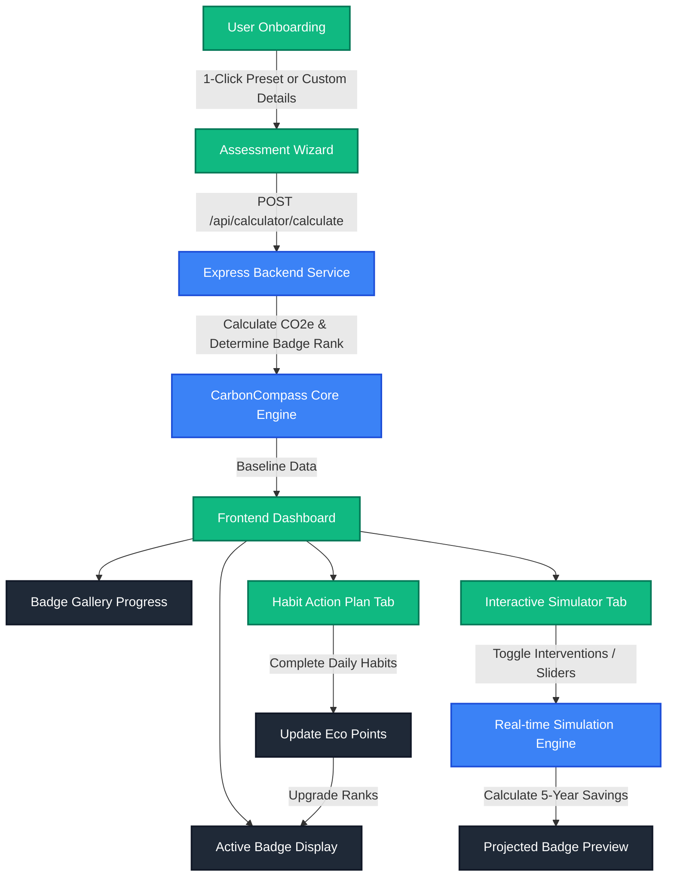

# 🧭 CarbonCompass

> **Measure. Simulate. Reduce. Make every choice count.**

[](https://carboncompass-878912160709.us-central1.run.app)
[](https://github.com)
[](https://opensource.org/licenses/MIT)

**CarbonCompass** is a premium, accessibility-compliant web application designed to help users baseline their carbon footprint, simulate green interventions in real time, and build habits using a gamified achievement system.

---

## 🌟 Key Features

*   **⚡ 1-Click Assessment Wizard**: Jump-start baseline calculations using smart visual preset cards (**Eco Champion**, **Balanced Citizen**, and **Carbon Heavy**).
*   **🎮 Interactive "What-If" Simulator**: Instantly simulate the impact of lifestyle modifications (installing solar panels, upgrading to an EV, adjusting dietary habits) and preview your projected CO₂e savings.
*   **🏆 Badge & Rank System**: Earn points and achieve badges ranging from **Bronze (High Impact)** to **Diamond (Net Zero Hero)** based on your actual carbon footprint.
*   **🌱 Habit Action Plan**: Track and check off daily sustainable habits to accumulate **Eco Points** and progress through badge levels.

---

## 📐 Architecture & Flow

The following flowchart shows how data flows through CarbonCompass, from the initial assessment wizard to active badge state, simulator adjustments, and habit check-ins.


---


## 🛠️ Technology Stack

| Layer | Technology | Key Libraries / Features |
| :--- | :--- | :--- |
| **Frontend** | React, Vite | Vanilla CSS custom variables, glassmorphism, responsive grid, dynamic SVG badges |
| **Backend** | Node.js, Express, TypeScript | REST APIs, validation middleware, loggers |
| **Testing** | Vitest | 100% coverage (statements, branches, functions, lines) across both Backend & Frontend |
| **Deployment** | GCP Cloud Run, Docker | Monorepo builder staging, lightweight alpine runtime, HTTP ready probes |
| **Accessibility** | WCAG 2.1 AA | Full focus outlines, ARIA radiogroups, keyboard tab indices, semantic tags, 100% verified via eslint-plugin-jsx-a11y |

---

## 🚀 Getting Started

### Prerequisites
- Node.js (v18 or higher)
- npm (v9 or higher)

### Installation
1. Clone the repository:
   ```bash
   git clone https://github.com/your-username/carbon-compass.git
   cd carbon-compass
   ```
2. Install dependencies:
   ```bash
   npm install
   ```

### Development Mode
To run the frontend dev server (with hot-reloading) and the backend API server concurrently:
```bash
# Start backend Express server
npm run dev -w backend

# Start frontend Vite server (in a separate terminal)
npm run dev -w frontend
```
Navigate to `http://localhost:5173`. The Vite server automatically proxies `/api/*` requests to the Express server running on port `8080`.

### Production Build & Run
To run the production-ready unified bundle:
```bash
# Build frontend and backend assets
npm run build

# Package static frontend assets into the backend public folder
rm -rf backend/public && cp -r frontend/dist backend/public

# Start the server
npm start
```
Navigate to `http://localhost:8080`.

### Running Tests
To run the full test suite:
```bash
npm run test
```

To view the 100% test coverage reports for both workspaces:
```bash
npm run test:coverage -w backend
npm run test:coverage -w frontend
```


---

## 🐳 Containerization & Cloud Run

To build and run the Docker container locally:
```bash
# Build the Docker image
docker build -t carboncompass-app .

# Run the container locally on port 8080
docker run -p 8080:8080 carboncompass-app
```
To deploy directly to Google Cloud Run:
```bash
gcloud run deploy carboncompass --source . --project carboncompass-499513 --region us-central1 --allow-unauthenticated
```
